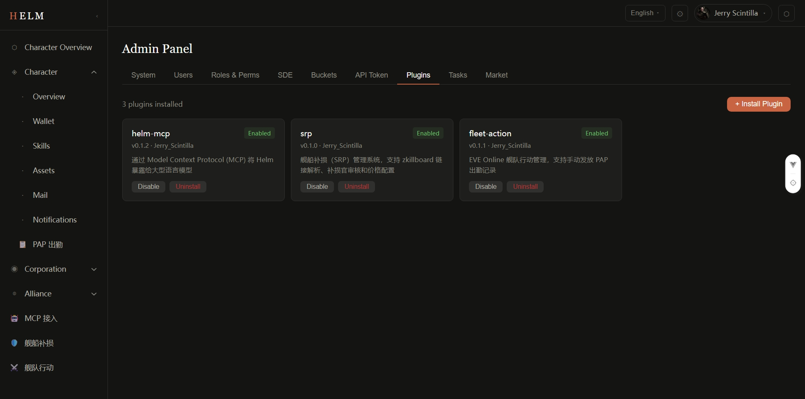

# Plugin Management

Helm's plugin system supports hot-reload — after installing or enabling a plugin, API routes take effect immediately with **no service restart required**.

## Plugin List

Go to **Admin Panel → Plugin Management** (`/admin/plugins`) to see all installed plugins:



| Column | Description |
|--------|-------------|
| Name | Plugin unique ID (URL slug) |
| Version | Plugin version number |
| Status | `enabled` / `disabled` / `error` |
| Router Mounted | Whether the route has been successfully hot-mounted |
| Author | Plugin author |
| Description | Plugin feature summary |

## Install a Plugin

Installation is an **async operation**: the request returns immediately and the backend runs pip install, database migration, and route mounting in the background. The admin UI streams install logs via SSE and shows a success notification when complete.

=== "Install from Marketplace"

    1. Switch to the **Marketplace** tab
    2. Browse or search for the plugin you need (supports filtering by name, description, or tags)
    3. Click the **Install** button on a plugin card
    4. Helm automatically pulls and installs the package from its listed source (PyPI or TestPyPI)

    The marketplace index is hosted on GitHub and automatically refreshed every 6 hours. Administrators can also click **Refresh Marketplace** to force an update. See [Plugin Marketplace](plugin-marketplace.md) for details.

=== "Install from PyPI"

    1. On the plugin list page, click **Install Plugin**
    2. Enter the PyPI package name, e.g. `helm-plugin-market-scanner`
    3. Click **Install** — the backend runs `pip install` and automatically loads the plugin
    4. After successful installation, the plugin appears in the list with status `enabled`

    **Via API:**
    ```bash
    # Install from PyPI (default)
    curl -X POST http://your-helm/api/v1/admin/plugins/install \
      -H "Authorization: Bearer <admin-token>" \
      -H "Content-Type: application/json" \
      -d '{"package_name": "helm-plugin-market-scanner", "source": "pypi"}'

    # Install from TestPyPI
    curl -X POST http://your-helm/api/v1/admin/plugins/install \
      -H "Authorization: Bearer <admin-token>" \
      -H "Content-Type: application/json" \
      -d '{"package_name": "helm-plugin-market-scanner", "source": "testpypi"}'
    ```

=== "Upload .whl Package"

    1. Click **Upload Plugin Package**
    2. Select a `.whl` file (e.g. `helm_plugin_market_scanner-0.1.0-py3-none-any.whl`)
    3. After upload, Helm automatically installs and loads the plugin

    **Via API:**
    ```bash
    curl -X POST http://your-helm/api/v1/admin/plugins/install/upload \
      -H "Authorization: Bearer <admin-token>" \
      -F "file=@helm_plugin_market_scanner-0.1.0-py3-none-any.whl"
    ```

## Enable a Plugin

Plugins are **enabled** by default after installation. To re-enable after a manual disable:

1. Find the target plugin in the plugin list
2. Click the **Enable** button
3. The plugin's API routes are immediately mounted at `/api/v1/plugins/{name}/`
4. The plugin's sidebar menu items immediately appear in the frontend

**Via API:**
```bash
curl -X POST http://your-helm/api/v1/admin/plugins/market-scanner/enable \
  -H "Authorization: Bearer <admin-token>"
```

## Disable a Plugin

After disabling, the plugin's routes are immediately unmounted and sidebar items disappear. Plugin data and configuration are retained:

1. Click the plugin's **Disable** button
2. Confirm the action

**Via API:**
```bash
curl -X POST http://your-helm/api/v1/admin/plugins/market-scanner/disable \
  -H "Authorization: Bearer <admin-token>"
```

## Uninstall a Plugin

Uninstallation is an **async operation**: the request returns `204` immediately and the backend executes the following sequence: disable plugin → downgrade database migrations (drop plugin tables) → pip uninstall → delete database record. When complete, the admin UI receives a `plugin.uninstalled` event via SSE, auto-refreshes the list, and shows a success notification.

1. Click the plugin's **Uninstall** button
2. Confirm the action in the confirmation dialog
3. Wait for the success notification (indicating the backend has completed all cleanup)

**Via API:**
```bash
curl -X DELETE http://your-helm/api/v1/admin/plugins/market-scanner \
  -H "Authorization: Bearer <admin-token>"
```

!!! warning "Uninstall is Irreversible"
    Uninstalling runs `pip uninstall` and drops the plugin's database tables. If you need to preserve data, manually back up the relevant tables before uninstalling.

## Check Plugin Status

```bash
curl http://your-helm/api/v1/admin/plugins/market-scanner/status \
  -H "Authorization: Bearer <admin-token>"
```

Response example:
```json
{
  "name": "market-scanner",
  "status": "enabled",
  "is_enabled": true,
  "is_loaded": true,
  "router_mounted": true,
  "error_message": null
}
```

## Notes

!!! warning "Celery Worker and Plugin Tasks"
    If a plugin registers Celery background tasks, you must **restart the Celery Worker** after enabling the plugin for the tasks to take effect. API routes are hot-loaded, but Celery tasks require the worker process to rediscover them.

    ```bash
    # Restart Worker
    celery -A app.tasks.celery_app worker --loglevel=info
    ```

!!! warning "Database Migrations"
    If a plugin includes database migration scripts, Helm automatically runs them via a subprocess during installation. If the migration fails, installation is rolled back (pip uninstall) and the plugin is not activated.

!!! tip "For Developers"
    If you are a plugin developer, see the [Plugin Development Guide](../plugin-dev/index.md) for how to build and publish plugins. Download the [AI Scaffold Skill](../downloads.md) to use Claude Code to generate a plugin skeleton instantly.
