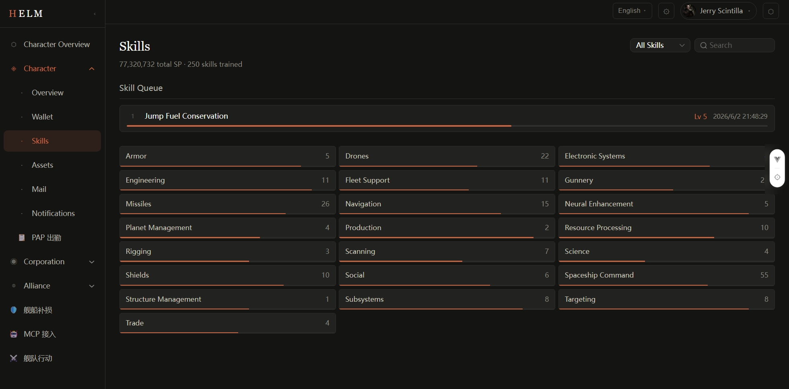
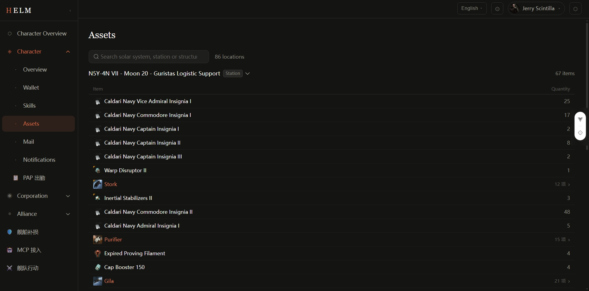
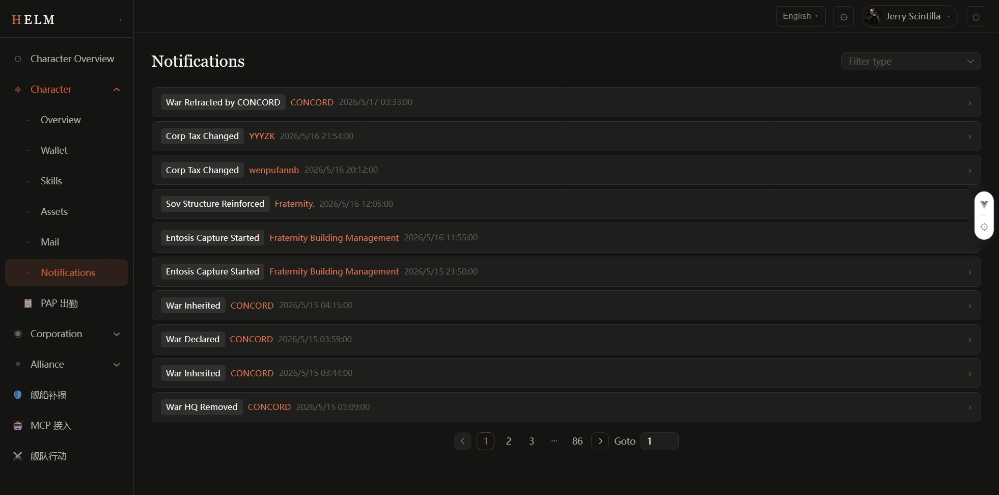

# Character Management

The Characters page displays detailed information about your bound EVE characters, with data synced in real time via the ESI API.

## Character List

Go to **Sidebar → Characters** to see all your bound characters. Each character card shows:

- Character portrait
- Character name
- Corporation and alliance
- Total skill points
- Wallet balance

Click a character card to open that character's detail page.

## Character Detail Page

### Basic Info

| Field | Description |
|-------|-------------|
| Character Name | Full EVE character name |
| Race | Caldari / Minmatar / Amarr / Gallente |
| Corporation | Current corporation name — click to navigate to the corp page |
| Alliance | Current alliance name |
| Corp Join Date | Timestamp when the character joined the current corporation |
| Security Status | EVE character security status |

### Skills

The Skills tab shows the character's trained skills:

- **Trained skills list**: grouped by skill category, showing each skill's current level (1–5)
- **Skill points**: total SP and SP distribution per skill group
- **Skill queue**: currently training skill and estimated completion time

!!! note
    Skill data requires the `esi-skills.read_skills.v1` scope to be included during EVE SSO authorization.

### Assets

The Assets tab lists all items owned by the character:

- Displays item icon, name, quantity, and location (system/station)
- Supports filtering by item name, type, or location
- Shows estimated value (ISK)

Item icons are fetched from the official EVE image server. Items are grouped by location. Container-type items (e.g., cargo containers, ship cargo bays) can be expanded to show their contents.

### Wallet

The Wallet tab includes:

- **ISK Balance**: current account balance
- **Journal**: transaction records with timestamp, type, amount, and description

### Mail

The Mail tab shows the character's EVE mail:

- Inbox list with sender, subject, and date
- Click to expand the mail body (supports EVE mail HTML rendering)

### Notifications

The Notifications tab shows in-game system notifications such as:

- Structure under attack
- Corporation application
- Contract completed
- Planetary interaction alerts

## Plugin Extensions

If the administrator has installed character extension plugins, additional data cards or sub-tabs may appear on the character detail page:

- **Widgets (data cards)**: injected into the top area of the character detail page, showing summary data provided by the plugin
- **Sub-modules (sub-tabs)**: presented as independent tabs with a full plugin interface

For example: a PAP activity tracking plugin can inject a "This Month's Fleet Participation" card into the character page.

## Data Refresh Frequency

| Data Type | Approximate Frequency |
|-----------|----------------------|
| Basic info | 1 hour |
| Skills | 1 hour |
| Assets | 1–6 hours |
| Wallet | 30 minutes |
| Mail | 30 minutes |
| Notifications | 30 minutes |

Actual frequency depends on ESI cache headers and Helm's bucket configuration.
