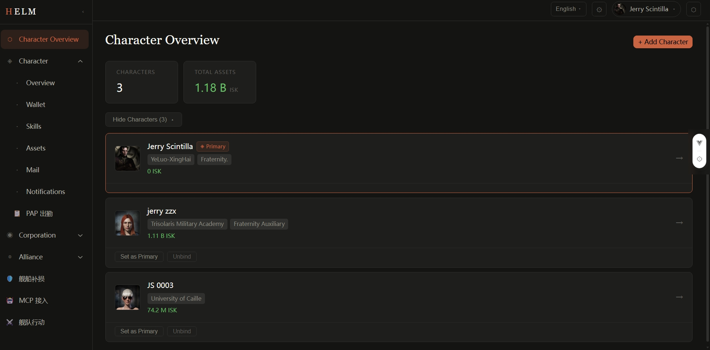

# Dashboard

The Dashboard is the main screen after logging in to Helm. It provides an overview of corporation and character data.

## Layout Sections

### Top Stats Cards

After login, the Dashboard header displays key statistics:

| Card | Description |
|------|-------------|
| Bound Characters | Total number of EVE characters bound to your account |
| Corp Members | Current online / total member count of your corporation |
| Asset Value | Total ISK valuation across all bound characters' assets (requires permission) |
| Recent Activity | Last ESI data synchronization time |

### Sidebar Navigation

The sidebar has two sections:

**Core features** (always visible):
- **Dashboard** — return to the home screen
- **Characters** — view your bound character list
- **Corporation** — view corporation information
- **Alliance** — view alliance information

**Plugin menu** (injected by enabled plugins):
- Specific entries depend on which plugins the administrator has installed
- Examples: "Market Scanner", "PAP Tracker", "Fleet Scheduler", etc.

### Main Content Area

The Dashboard's main content area shows different information panels based on your permissions, which may include:
- Recent killmails (requires a killboard plugin)
- Corporation event alerts
- ESI data sync status

## Quick Actions

| Action | Location |
|--------|----------|
| View a character's details | Sidebar → Characters → click character name |
| Switch active character | Top-right avatar dropdown |
| Enter Admin panel | Top-right avatar → Admin Panel (admin only) |
| View API Tokens | Top-right avatar → Account Settings |
| Logout | Top-right avatar → Logout |

## ESI Data Refresh Status

The Dashboard or character pages may show a **last sync time**, indicating when ESI data was last updated. Helm refreshes data periodically via background Celery tasks. Typical latency is 15–60 minutes depending on bucket configuration and ESI rate limits.
